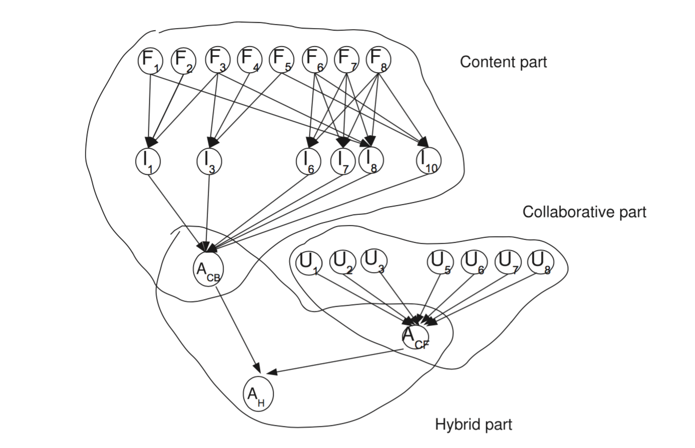

## Initial Data exploration 
-  user id | age | gender | occupation | zip code


-  movie id | movie title | release date | video release date |
              IMDb URL | unknown | Action | Adventure | Animation |
              Children's | Comedy | Crime | Documentary | Drama | Fantasy |
              Film-Noir | Horror | Musical | Mystery | Romance | Sci-Fi |
              Thriller | War | Western |
              The last 19 fields are the genres
              
              
-  100000 ratings by 943 users on 1682 items.

## Slide with R Code and Output
```{r,echo=FALSE,message=FALSE,warning=FALSE}
data=read.csv("Personal.csv")
age=data$age
age.divide=c(20,25,30,35,40,50)
age.group=rep(7,943)
for(i in 1:943){
  for(j in 1:6)
  if(age[i]<=age.divide[j]){
    age.group[i]=j
    break
    }
}

##age
#tapply(data[,c(56)][complete.cases(data[,56])],INDEX =age.group[complete.cases(data[,56])],FUN = mean)

m = as.matrix(data[, 7:1670])
m[is.na(m)]<-0
a<-apply(m,2,function(c)sum(c!=0))
#names(sort(a)[1655:1664])

for(i in which(names(data) %in% names(sort(a)[1655:1664]))){
  #print(tapply(data[,c(i)][complete.cases(data[,i])],INDEX = age.group[complete.cases(data[,i])],FUN = mean))
}
library(plotly)
dat=data
dat$agegroup=as.factor(age.group)
dat=dat[,c(1,293,1671)]
d=dat[complete.cases(data[,293]),]
p=plot_ly(d, x = Scream..1996., color = agegroup,type="box")
p


#gender
#tapply(data[,c(56)][complete.cases(data[,56])],INDEX = data$gender[complete.cases(data[,56])],FUN = mean)
#mean(data[,c(57)],na.rm=TRUE)

m = as.matrix(data[, 7:1670])
m[is.na(m)]<-0
a<-apply(m,2,function(c)sum(c!=0))
#names(sort(a)[1655:1664])

for(i in which(names(data) %in% names(sort(a)[1655:1664]))){
 # print(tapply(data[,c(i)][complete.cases(data[,i])],INDEX = data$gender[complete.cases(data[,i])],FUN = mean))
}


```

## Potential Factor Plot
```{r, echo=FALSE,c.show="hold",fig.width=6, fig.height=3,warning=FALSE,message=FALSE}
m = as.matrix(data[, 7:1670])
m[is.na(m)]<-0
numberofrating<-apply(m,2,function(c)sum(c!=0))
popular<-names(sort(numberofrating)[1655:1664]) #top 10 popular
index<-which(colnames(data) %in% popular)
title<-as.character(colnames(data)[index])

gender.mean<-matrix(rep(0,30),nrow=10)
for(i in 1:10){
  gender.mean[i,]=c(tapply(data[,index[i]][complete.cases(data[,index[i]])],INDEX = data$gender[complete.cases  (data[,index[i]])],FUN = mean),mean(data[,index[i]],na.rm=TRUE))
  }

colnames(gender.mean)<-c("M","F","overall")
rownames(gender.mean)<-title
#gender.mean
rownames(gender.mean)<-c(1:10)

ylim <- c(0, max(gender.mean[,3]) * 1.1) 
cols <- terrain.colors(2) 
barplot(t(gender.mean[,1:2]), ylim = ylim, offset = 0, axis.lty = 1, col = cols,beside=T,main="Example of gender effect")
legend("topright",legend=rownames(t(gender.mean[,1:2])),fill=cols,cex=0.75)
box()


##occupation

x=tapply(data[,305][complete.cases(data[,305])],INDEX = data$occupation[complete.cases(data[,305])],FUN = mean)

barplot(x,col=c(1:20),main = "Example of occupation effect(Air Force)")

u.user<-read.delim("u.user",sep="|",head=F)
names(u.user)<-c("userid","age","gender","occupation","zipcode")
part<-matrix(rep(0,943*1664),ncol=1664) 
library("recommenderlab")
data(MovieLense)
for(i in 1:943){
  u<-MovieLense[i]
  uu<-as(u,"matrix")
  part[i,]<-uu
}
data<-cbind(u.user,part)
colnames(part)<-colnames(uu)
data<-cbind(u.user,part)
u.item<-read.delim("u.item",sep="|",head=F)
names(u.item)<-c("moveid","movietitle","releasedate","videoreleasedate","IMDbURL","uknown","Action","Adventure","Animation","Children's","Comedy","Crime","Documentary","Drama","Fantasy","Film-Noir","Horror","Musical","Mystery","Romance","Sci-Fi","Thriller","War","Western")
m = as.matrix(data[,6:1669])
m[is.na(m)]<-0
numberofrating<-apply(m,1,function(c)sum(c!=0))
active<- which(order(numberofrating) %in% c(1:10)) #top 10 active person
category<-rep(0,18)
for(i in 1:18){
  index<-which(u.item[,6+i]!=0)
  title<-u.item$movietitle[index]
  indice<-which(colnames(data)[6:1669] %in% as.character(title))+5
  m<-as.matrix(data[868,indice])
  category[i]<-mean(m,na.rm=TRUE)
}
names(category)<-colnames(u.item)[7:24]
cols<-terrain.colors(23)
barplot(category,xlab="Category",ylim=c(0,5),col=cols,main="Example of category effect(person1)")

category<-rep(0,18)
for(i in 1:18){
  index<-which(u.item[,6+i]!=0)
  title<-u.item$movietitle[index]
  indice<-which(colnames(data)[6:1669] %in% as.character(title))+5
  m<-as.matrix(data[452,indice])
  category[i]<-mean(m,na.rm=TRUE)
}
names(category)<-colnames(u.item)[7:24]
cols<-terrain.colors(23)
barplot(category,xlab="Category",ylim=c(0,5),col=cols,main="Example of category effect(person2)")

```

## Hybrid recommender system

